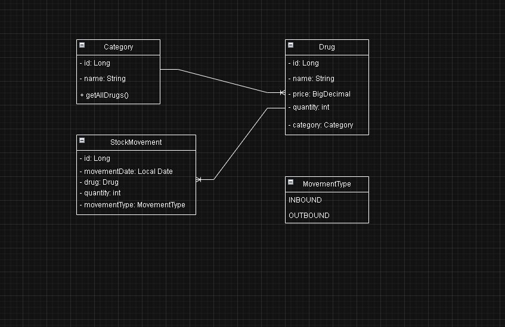

# Pharmacy Management

A Spring Boot application for managing a pharmacy inventory, including drugs, categories, and stock movements. Supports creating, updating, and filtering drugs and stock movements.

## Environment

- Spring Boot: 3.5.6
- JDK: 21
- Database: MySQL

## How to Run

1. Clone the repository
```
git clone https://github.com/liakosV/pharmacy-management.git
```


2. Navigate to the project folder
```
cd pharmacy-management
```


3. Configure your database in `src/main/resources/application-test.properties`:
```
spring.datasource.url=jdbc:mysql://localhost:3306/pharmacy_project
spring.datasource.username=YOUR_DB_USERNAME
spring.datasource.password=YOUR_DB_PASSWORD
spring.jpa.hibernate.ddl-auto=update
```
4. In `src/main/resources/application-test.properties` has directions on how to insert mock entities:
```
## COMMENT AT CREATE, UNCOMMENT AT FIRST UPDATE AND COMMENT AGAIN AFTER THE FIRST UPDATE
#spring.sql.init.mode=always
#spring.sql.init.data-locations=classpath:sql/categories.sql, classpath:sql/drugs.sql, classpath:sql/stock_movements.sql

```


5. Build and run the application
```
./gradlew bootrun
```

6. Access the API through SwaggerAPI at `http://localhost:8080/swagger-ui/index.html#/`

## UML Diagram



## Features

- Create, update, and list drugs
- Manage drugs categories
- Record and filter stock movements (inbound/outbound)
- Filter movements by drug name and date range

